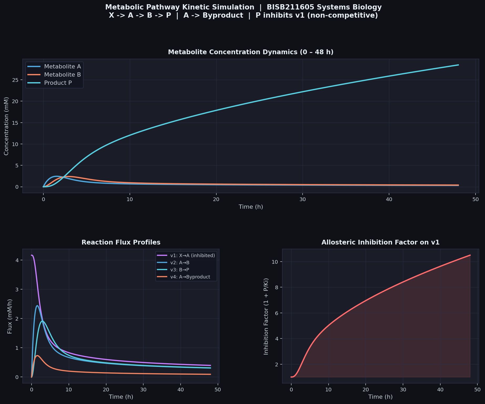

# Metabolic Pathway Kinetic Simulation
### Systems Biology | UAS Bioteknologi 2025/2026 

---

## Overview

This project simulates the kinetic dynamics of a **4-reaction metabolic branch-point pathway** in a microbial host engineered to produce a high-value biochemical. The model incorporates Michaelis–Menten kinetics, first-order rate laws, and **non-competitive allosteric feedback inhibition** of the first committed step by the final product.

---

## Pathway Topology

```
                    ┌─────────────────────────────────┐
                    │  Allosteric Inhibition (P ⊣ v1) │  (non-competitive)
                    └──────────────────┬──────────────┘
                                       │ (dashed feedback)
                                       ▼
    X ──v1──► A ──v2──► B ──v3──► P
                │
               v4
                │
                ▼
           Byproduct
```

| Symbol | Description |
|--------|-------------|
| X | External substrate (constant concentration) |
| A | Internal intermediate metabolite A |
| B | Internal intermediate metabolite B |
| P | Target product (also feedback inhibitor) |
| v1 | Committed input flux: X → A (Michaelis–Menten, inhibited by P) |
| v2 | First-order flux: A → B |
| v3 | First-order flux: B → P |
| v4 | Competing escape flux: A → Byproduct |

---

## Stoichiometric Matrix S

Rows = internal metabolites; Columns = reaction fluxes.

|              | v1 | v2 | v3 | v4 |
|--------------|:--:|:--:|:--:|:--:|
| Metabolite A | +1 | −1 |  0 | −1 |
| Metabolite B |  0 | +1 | −1 |  0 |
| Product P    |  0 |  0 | +1 |  0 |

---

## Kinetic Equations

### Baseline ODEs (ignoring inhibition)

$$\frac{d[A]}{dt} = v_1 - v_2 - v_4$$

$$\frac{d[B]}{dt} = v_2 - v_3$$

$$\frac{d[P]}{dt} = v_3$$

### Rate Laws

v1 uses **Michaelis–Menten kinetics with non-competitive product inhibition**:

$$v_1 = \frac{V_{1,max} \cdot [X]}{(K_{m1} + [X]) \cdot \left(1 + \dfrac{[P]}{K_i}\right)}$$

v2, v3, v4 follow **first-order kinetics**:

$$v_2 = k_2 \cdot [A], \quad v_3 = k_3 \cdot [B], \quad v_4 = k_4 \cdot [A]$$

### Full ODEs with Inhibition

$$\frac{d[A]}{dt} = \frac{V_{1,max} \cdot [X]}{(K_{m1} + [X])\left(1 + \frac{[P]}{K_i}\right)} - k_2[A] - k_4[A]$$

$$\frac{d[B]}{dt} = k_2[A] - k_3[B]$$

$$\frac{d[P]}{dt} = k_3[B]$$

---

## Parameters

| Parameter | Meaning | Value |
|-----------|---------|-------|
| V1max | Maximum rate of v1 | 5.0 mM/h |
| Km1 | Michaelis constant for v1 | 2.0 mM |
| Ki | Inhibition constant (P on v1) | 3.0 mM |
| X | External substrate concentration | 10 mM (constant) |
| k2 | First-order rate constant for A → B | 1.0 h⁻¹ |
| k3 | First-order rate constant for B → P | 0.8 h⁻¹ |
| k4 | First-order rate constant for A → Byproduct | 0.3 h⁻¹ |

---

## Simulation Script

```python
# ============================================================
# BISB211605 – Systems Biology
# Metabolic Pathway Kinetic Simulation
# Non-competitive allosteric inhibition of v1 by Product P
# ============================================================

import numpy as np
from scipy.integrate import solve_ivp
import matplotlib.pyplot as plt
import matplotlib.gridspec as gridspec

# ── Parameters ──────────────────────────────────────────────
V1max = 5.0   # Max rate of v1 (mM/h)
Km1   = 2.0   # Michaelis constant for v1 (mM)
Ki    = 3.0   # Inhibition constant — P on v1 (mM)
X     = 10.0  # External substrate, held constant (mM)
k2    = 1.0   # A → B  first-order rate constant (h⁻¹)
k3    = 0.8   # B → P  first-order rate constant (h⁻¹)
k4    = 0.3   # A → Byproduct first-order rate constant (h⁻¹)

# ── ODE System ───────────────────────────────────────────────
def pathway_odes(t, y):
    """
    State vector y = [A, B, P]
    Returns dy/dt = [dA/dt, dB/dt, dP/dt]
    """
    A, B, P = y

    # v1: Michaelis-Menten with non-competitive inhibition by P
    v1 = (V1max * X) / ((Km1 + X) * (1 + P / Ki))

    # First-order fluxes
    v2 = k2 * A   # A → B
    v3 = k3 * B   # B → P
    v4 = k4 * A   # A → Byproduct (escape flux)

    dA = v1 - v2 - v4
    dB = v2 - v3
    dP = v3

    return [dA, dB, dP]

# ── Helper: compute all fluxes at each time point ────────────
def compute_fluxes(y_matrix):
    A, B, P = y_matrix
    v1 = (V1max * X) / ((Km1 + X) * (1 + P / Ki))
    v2 = k2 * A
    v3 = k3 * B
    v4 = k4 * A
    return v1, v2, v3, v4

# ── Solve ────────────────────────────────────────────────────
t_span = (0, 48)                          # 48-hour fermentation
t_eval = np.linspace(0, 48, 500)
y0     = [0.0, 0.0, 0.0]                 # all pools start empty

solution = solve_ivp(
    pathway_odes,
    t_span,
    y0,
    t_eval=t_eval,
    method='RK45',
    rtol=1e-8,
    atol=1e-10
)

A_t, B_t, P_t = solution.y
V1_t, V2_t, V3_t, V4_t = compute_fluxes(solution.y)

# ── Print summary ─────────────────────────────────────────────
print("=" * 50)
print("SIMULATION SUMMARY (t = 48 h)")
print("=" * 50)
print(f"  Metabolite A : {A_t[-1]:.4f} mM")
print(f"  Metabolite B : {B_t[-1]:.4f} mM")
print(f"  Product P    : {P_t[-1]:.4f} mM")
print(f"  v1 (final)   : {V1_t[-1]:.4f} mM/h")
print(f"  Inhibition   : {1 + P_t[-1]/Ki:.4f}x fold reduction on v1")
print("=" * 50)

# ── Plot ──────────────────────────────────────────────────────
PANEL_BG = '#1a1d27'
GRID_C   = '#2e3148'
LABEL_C  = '#c9d1d9'
TITLE_C  = '#e6edf3'

def style_ax(ax, title):
    ax.set_facecolor(PANEL_BG)
    for sp in ax.spines.values():
        sp.set_edgecolor(GRID_C)
    ax.tick_params(colors=LABEL_C, labelsize=9)
    ax.xaxis.label.set_color(LABEL_C)
    ax.yaxis.label.set_color(LABEL_C)
    ax.set_title(title, color=TITLE_C, fontsize=11, fontweight='bold', pad=8)
    ax.grid(color=GRID_C, linewidth=0.6, alpha=0.8)

fig = plt.figure(figsize=(14, 10), facecolor='#0f1117')
gs  = gridspec.GridSpec(2, 2, figure=fig, hspace=0.42, wspace=0.32)

# — Panel 1: Metabolite concentrations (spans full width) ——
ax1 = fig.add_subplot(gs[0, :])
ax1.plot(t_eval, A_t, color='#4ea8de', lw=2.2, label='Metabolite A')
ax1.plot(t_eval, B_t, color='#f4845f', lw=2.2, label='Metabolite B')
ax1.plot(t_eval, P_t, color='#56cfe1', lw=2.2, label='Product P')
style_ax(ax1, 'Metabolite Concentration Dynamics  (0 – 48 h)')
ax1.set_xlabel('Time (h)')
ax1.set_ylabel('Concentration (mM)')
ax1.legend(facecolor='#12151f', edgecolor=GRID_C, labelcolor=LABEL_C, fontsize=10)

# — Panel 2: Flux profiles ——
ax2 = fig.add_subplot(gs[1, 0])
flux_series = [
    ('v1: X→A (inhibited)', V1_t, '#c77dff'),
    ('v2: A→B',             V2_t, '#4ea8de'),
    ('v3: B→P',             V3_t, '#56cfe1'),
    ('v4: A→Byproduct',     V4_t, '#f4845f'),
]
for label, data, color in flux_series:
    ax2.plot(t_eval, data, lw=2, label=label, color=color)
style_ax(ax2, 'Reaction Flux Profiles')
ax2.set_xlabel('Time (h)')
ax2.set_ylabel('Flux (mM/h)')
ax2.legend(facecolor='#12151f', edgecolor=GRID_C, labelcolor=LABEL_C, fontsize=8)

# — Panel 3: Inhibition factor over time ——
inhib_factor = 1 + P_t / Ki
ax3 = fig.add_subplot(gs[1, 1])
ax3.plot(t_eval, inhib_factor, color='#ff6b6b', lw=2.2)
ax3.fill_between(t_eval, 1, inhib_factor, color='#ff6b6b', alpha=0.15)
style_ax(ax3, 'Allosteric Inhibition Factor on v1  (1 + P/Ki)')
ax3.set_xlabel('Time (h)')
ax3.set_ylabel('Fold Reduction')

fig.suptitle(
    'Metabolic Pathway Kinetic Simulation  |  BISB211605 Systems Biology\n'
    'X → A → B → P   |   A → Byproduct   |   P inhibits v1 (non-competitive)',
    color=TITLE_C, fontsize=12, fontweight='bold', y=1.01
)

plt.savefig('simulation_full.png', dpi=160, bbox_inches='tight',
            facecolor=fig.get_facecolor())
plt.show()
print("Figure saved as simulation_full.png")
```

---

## Simulation Output



### Interpretation

**Panel 1 — Concentration Dynamics**

- **Metabolite A** rises sharply in the first few hours as v1 supplies flux, then plateaus at a low steady state (~0.31 mM). Consumption by v2 and v4 balances input.
- **Metabolite B** peaks early and stabilises at ~0.39 mM — its low steady state reflects efficient conversion to P by v3.
- **Product P** accumulates continuously across the 48 h fermentation, reaching ~28.5 mM. Because P has no downstream consumer in this model, it is the terminal sink.

**Panel 2 — Flux Profiles**

- **v1** starts near its maximum (~4.17 mM/h, already limited by X saturation), then declines progressively as P accumulates and tightens inhibition.
- **v2** and **v4** mirror the rise-and-plateau of A.
- **v3** stabilises at the low steady-state flux determined by B.

**Panel 3 — Inhibition Factor**

- The fold-reduction factor (1 + P/Kᵢ) rises from 1× to ~10.5× by t = 48 h, illustrating the progressive throttling of the pathway entry flux by its own product — a classic negative feedback motif that limits overproduction toxicity.

---

## Project Structure

```
📂 project/
├── README.md              ← this file
├── simulation.py          ← full Python simulation script
└── simulation_full.png    ← output figure
```

---

## Requirements

```
python >= 3.8
numpy
scipy
matplotlib
```

Install with:

```bash
pip install numpy scipy matplotlib
```

Run with:

```bash
python simulation.py
```

---

## References

- Heinrich, R. & Schuster, S. (1996). *The Regulation of Cellular Systems*. Springer.
- Palsson, B.Ø. (2015). *Systems Biology: Constraint-based Reconstruction and Analysis*. Cambridge University Press.
- Course GitHub: [lab-biotek-bio-ugm/S1_BISB211605_Biotechnology](https://github.com/lab-biotek-bio-ugm/S1_BISB211605_Biotechnology)

---

*Fakultas Biologi — Universitas Gadjah Mada | UAS Genap T.A. 2025/2026 | Dosen: Matin Nuhamunada, M.Sc., Ph.D.*
